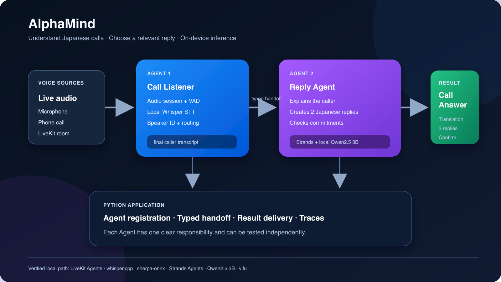

# AlphaMind

AlphaMind gives foreign residents real-time intelligence for Japanese phone
calls. It listens to the caller and explains the meaning in Simplified Chinese.
It then provides two relevant Japanese reply options. It flags dates,
prices, appointments, and other commitments before the user answers.

The project is one Python application with two independent Agents. It targets
the Everyday Agents track of the Agents for Humans Hackathon.



## The two-Agent design

```python
import sys

from vifu import LocalLlama, LocalWhisper, Vifu
from japanese_reply_agent import JapaneseReplyAgent
from reasoning_config import ReasoningConfig
from speaker_identification import LocalSpeakerIdentifier
from voice_agent import JapaneseCallListenerAgent

app = Vifu("AlphaMind")
gpu_layers = (
    36
    if sys.platform == "darwin"
    and getattr(LocalLlama, "supports_safe_accelerator_shutdown", False)
    else 0
)

call_listener = JapaneseCallListenerAgent(
    language="ja-JP",
    handoff="japanese-reply-agent",
    transcriber=LocalWhisper(model="ggml-small.bin", language="ja"),
    speaker_identifier=LocalSpeakerIdentifier(),
)

reply_agent = JapaneseReplyAgent(
    ReasoningConfig.local(
        LocalLlama(
            model="qwen2.5-3b-instruct-q4_k_m.gguf",
            context_size=8_192,
            gpu_layers=gpu_layers,
            timeout=30,
        )
    )
)

app.agent("japanese-call-listener", call_listener)
app.agent("japanese-reply-agent", reply_agent)
app.run()
```

- `japanese-call-listener` owns the LiveKit audio session, VAD, speech-to-text,
  local speaker identification, speaker routing, final-turn ordering, handoff,
  and result delivery. It enrolls the listener's voice, sends only caller
  turns to Strands, and keeps uncertain turns out of reasoning. It drops known non-speech
  markers and suppresses repeated final transcripts for three seconds per
  session and speaker. While reasoning is busy, it coalesces waiting final
  transcripts to the newest turn instead of building a stale inference queue.
- `japanese-reply-agent` is a Strands specialist. It explains the caller's
  Japanese, provides distinct response options, identifies commitments and
  risks, and publishes one schema-validated Assist Card.
- The `vifu` Python package registers both Agents, routes their typed handoff,
  and records each invocation as a separate trace.

The Call Listener never performs the specialist reasoning. The Reply Agent
never owns the audio room. Provider errors fail visibly and do not switch the
application to another model.

## Local quickstart

The verified development environments use Python 3.12 and 3.13 with `uv`.

Place these models in `~/.vifu/models/`:

```text
~/.vifu/models/ggml-small.bin
~/.vifu/models/qwen2.5-3b-instruct-q4_k_m.gguf
~/.vifu/models/3dspeaker_speech_eres2net_base_sv_zh-cn_3dspeaker_16k.onnx
```

- `ggml-small.bin` is the multilingual
  [whisper.cpp small model](https://huggingface.co/ggerganov/whisper.cpp/blob/main/ggml-small.bin).
  The English-only model cannot transcribe Japanese.
- `qwen2.5-3b-instruct-q4_k_m.gguf` is the official
  [Qwen2.5 3B Instruct GGUF](https://huggingface.co/Qwen/Qwen2.5-3B-Instruct-GGUF)
  Q4_K_M model. The 3B model is the default because the 0.5B variant did not
  reliably preserve Japanese deadlines or produce natural reply suggestions.
- `3dspeaker_speech_eres2net_base_sv_zh-cn_3dspeaker_16k.onnx` is the
  [sherpa-onnx speaker model](https://github.com/k2-fsa/sherpa-onnx/releases/tag/speaker-recongition-models).
  It identifies the listener and multiple callers locally.

Install the locked dependencies from PyPI:

```bash
uv sync --frozen
```

The lock file pins all public Python dependencies. `uv` manages the project
environment, so you do not need to create or activate a virtual environment.

Run the deterministic two-Agent demo first:

```bash
uv run --frozen python main.py demo
```

This command loads the local models and sends one Japanese turn through both
Agents. It prints the resulting Assist Card.

Then start the interactive microphone experience:

```bash
uv run --frozen python main.py
```

AlphaMind first asks you to say one complete sentence. That voice becomes the
listener profile for the current session. Later listener speech is shown but
does not trigger Strands. Caller voices are assigned stable `caller-N` labels;
short or ambiguous speech is skipped instead of being guessed.

The default console shows the microphone meter, final Japanese transcript,
analysis status, and Assist Card. Framework debug logs, raw tool calls, and
native model-loading messages stay out of the user view. For development
diagnostics, run `uv run --frozen python main.py --debug`.

On Apple Silicon, `main.py` offloads 36 Qwen transformer layers to Metal when
the installed runtime supports safe accelerator shutdown. Other environments
use CPU execution. The local model timeout is 30 seconds.

[LiveKit console mode](https://docs.livekit.io/agents/server/startup-modes/)
uses the computer audio device. The voice pipeline runs in the local process.
`main.py` configures local Whisper and Qwen models. This path does not read
`.env.local` or join a hosted LiveKit room.

## Tests

Run the App suite:

```bash
uv run --frozen python -m unittest discover -s tests -v
```

The tests cover the two-Agent registration, the real in-process handoff,
non-speech and duplicate-turn filtering, Strands tool schema, result validation,
interruption ordering, and deterministic retry of unsafe model output.

## Model and safety behavior

The Strands Agent must call its `card` tool exactly once per attempt. The tool
requires two response options. Pydantic and deterministic checks
reject duplicate responses, copied caller requests, unsafe commitments, and
incorrect dates. The application uses deterministic decoding and retries a
rejected card once with the same model. If the result is still unusable, the
Agent returns a safe clarification card so the voice session can continue.
When the caller asks the listener for personal or booking information, the
model translates the request while the application supplies safe listener-side
responses. It never fills unknown names, dates, amounts, or numbers for the
user.

## Hackathon fit

The specialist is a real Strands Agent, not a prompt-only wrapper. It uses the
Strands `Agent` loop and a structured `@tool`. A deterministic validation
boundary checks each result before the application shows an Assist Card.

The [official requirements](https://agentsforhumans.devpost.com/rules) state
that Amazon Bedrock AgentCore deployment can strengthen the Technical
Implementation score, but is not required. This project therefore keeps cloud
deployment outside the verified submission path. A complete entry still needs
the public repository, architecture diagram, and a public demo video of no more
than five minutes. It also needs the submitter's AWS Builder ID.

## Project provenance

AlphaMind was created during the hackathon submission period. It uses the
public Strands Agents, LiveKit Agents, Pydantic, and `vifu` Python packages.
The `vifu` package supplies local model adapters and Agent routing. The model
files are separate downloads and are not part of this repository.

The project is licensed under Apache License 2.0. See [LICENSE](LICENSE).
